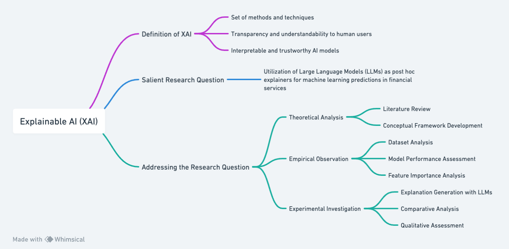
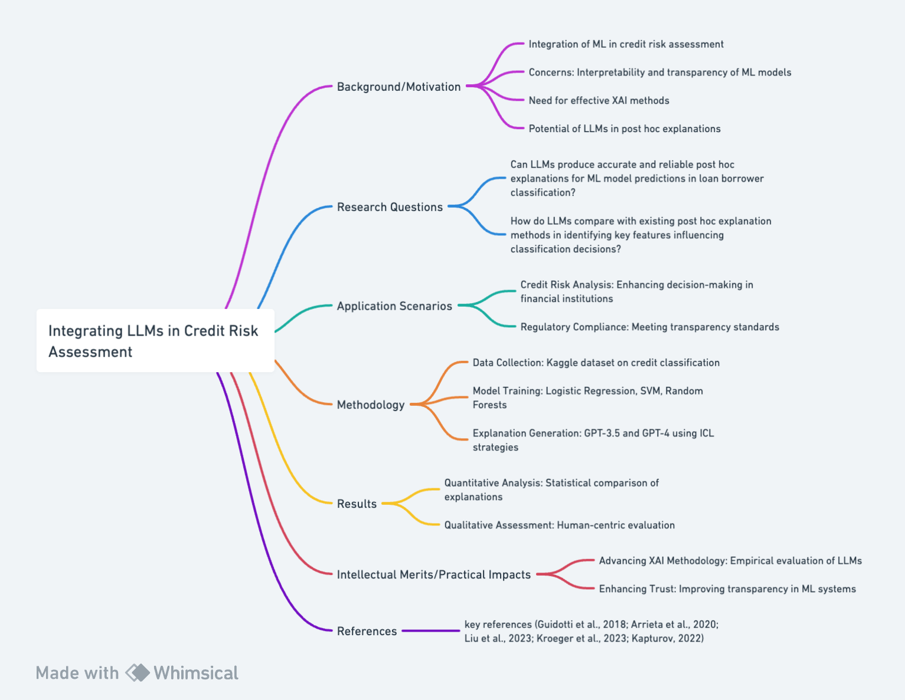

# Research on Explainable AI (XAI) and Large Language Models (LLMs)

## Question 1

### Definition of XAI
Explainable AI (XAI) refers to the set of methods and techniques that make the outputs and operations of AI systems transparent and understandable to human users (Arrieta et al., 2020). The primary goal of XAI is to create AI models that are interpretable and trustworthy, particularly in scenarios where decisions have significant consequences. A key reference in this domain is "Explainable Artificial Intelligence (XAI): Concepts, Taxonomies, Opportunities and Challenges toward Responsible AI" by Arrieta et al. (2020). This article provides a comprehensive overview of XAI, discussing its importance, methodologies, and applications, and is a valuable resource for understanding XAI.

### Salient Research Question
A current and significant research question in XAI is: "How can Large Language Models (LLMs) be effectively utilized as post hoc explainers for machine learning predictions in financial services?" This question is inspired by the growing interest in leveraging LLMs for explanation generation, as discussed in recent literature, such as Liu et al. (2023), which explores the potential of LLMs in providing in-context explanations.

### Addressing the Research Question

#### Theoretical Analysis
- **Literature Review:** Conduct an extensive review of existing literature on XAI, focusing on the role of LLMs in generating explanations.
- **Conceptual Framework Development:** Develop a theoretical framework that outlines the potential of LLMs in generating post hoc explanations, comparing their capabilities with traditional methods like LIME and SHAP.

#### Empirical Observation
- **Dataset Analysis:** Conduct a detailed analysis of the dataset's characteristics, such as feature distributions, class imbalances, and potential biases.
- **Model Performance Assessment:** Evaluate the performance of baseline ML models (Logistic Regression, SVM, Random Forests) considering various metrics.
- **Feature Importance Analysis:** Analyze the feature importance as determined by the baseline models.

#### Experimental Investigation
- **Explanation Generation with LLMs:** Implement LLMs like GPT-3.5 and GPT-4, using various in-context learning strategies to generate explanations.
- **Comparative Analysis:** Compare the LLM-generated explanations with those from established methods using metrics like Feature Agreement (FA) and Rank Agreement (RA).
- **Qualitative Assessment:** Conduct a thorough qualitative assessment of the explanations, involving domain experts and lay users.

## References
- Arrieta, A. B., Díaz-Rodríguez, N., Del Ser, J., Bennetot, A., Tabik, S., Barbado, A., ...& Herrera, F. (2020). Explainable Artificial Intelligence (XAI): Concepts, taxonomies, opportunities and challenges toward responsible AI. Information fusion, 58, 82-115.
- Liu, P., Yuan, W., Fu, J., Jiang, Z., Hayashi, H., & Neubig, G. (2023). Pre-train, prompt, and predict: A systematic survey of prompting methods in natural language processing. ACM Computing Surveys, 55(9), 1-35.

## Question 2

### Investigate the capacity of Large Language Models for post hoc explanations in credit classification

#### Background/Motivation
The integration of machine learning (ML) models in financial services, particularly in the classification of loan borrowers, marks a significant advancement in credit risk assessment. However, the opacity of these ML models, often described as "black boxes," raises critical concerns regarding their interpretability and transparency (Guidotti et al., 2018). The increasing demand for explainable AI (XAI) in regulatory and societal contexts underscores the need for effective post hoc explanation methods that clarify the decision-making processes of ML models (Arrieta et al., 2020). The advent of Large Language Models (LLMs) and their capability for in-context learning (ICL) presents a novel approach to generating such explanations (Liu et al., 2023). This study aims to explore the potential of LLMs in providing post hoc explanations within the framework of loan borrower classification in banking.

#### Research Question
- Can LLMs produce accurate and reliable post hoc explanations for ML model predictions in loan borrower classification?
- How do LLMs compare with existing post hoc explanation methods in identifying key features influencing classification decisions?

#### Application Scenarios
- **Credit Risk Analysis:** The application of LLM-generated explanations can significantly enhance the understanding of risk factors in loan applications.
- **Regulatory Compliance:** LLMs' ability to provide transparent explanations is vital for meeting compliance standards.

#### Methodology
- **Data Collection:** Utilizing the Kaggle dataset on credit classification (Kapturov, 2022), the study will involve extensive preprocessing.
- **Model Training:** Employing Logistic Regression, SVM, and Random Forests, the study will establish baseline classifiers.
- **Explanation Generation:** LLMs, specifically GPT-3.5 and GPT-4, will be utilized for generating post hoc explanations.
- **Evaluation:** The study will assess the explanations using metrics like Feature Agreement (FA) and Rank Agreement (RA).

#### Results
- **Quantitative Analysis:** Statistical analysis of the fidelity of LLM-generated explanations against traditional methods.
- **Qualitative Assessment:** Human-centric evaluation of the explanations' interpretability.

#### Intellectual Merits/Practical Impacts
- **Advancing XAI Methodology:** This research aims to contribute to the XAI field by empirically evaluating LLMs as post hoc explainers.
- **Enhancing Trust in ML Systems:** By improving the transparency of ML decision-making systems, the study seeks to bolster trust among users and stakeholders.

## References
- Arrieta, A. B., Díaz-Rodríguez, N., Del Ser, J., Bennetot, A., Tabik, S., Barbado, A., ...& Herrera, F. (2020). Explainable Artificial Intelligence (XAI): Concepts, taxonomies, opportunities and challenges toward responsible AI. Information fusion, 58, 82-115.
- Guidotti, R., Monreale, A., Ruggieri, S., Turini, F., Giannotti, F., & Pedreschi, D. (2018). A survey of methods for explaining black box models. ACM computing surveys (CSUR), 51(5), 1-42.
- Kapturov, A. (2022). Credit Classification for Banks [Data set]. Kaggle. https://www.kaggle.com/datasets/kapturovalexander/credit-classification-for-banks/data
- Kroeger, N., Ley, D., Krishna, S., Agarwal, C., & Lakkaraju, H. (2023). Are Large Language Models Post Hoc Explainers?. arXiv preprint arXiv:2310.05797.
- Liu, P., Yuan, W., Fu, J., Jiang, Z., Hayashi, H., & Neubig, G. (2023). Pre-train, prompt, and predict: A systematic survey of prompting methods in natural language processing. ACM Computing Surveys, 55(9), 1-35.

